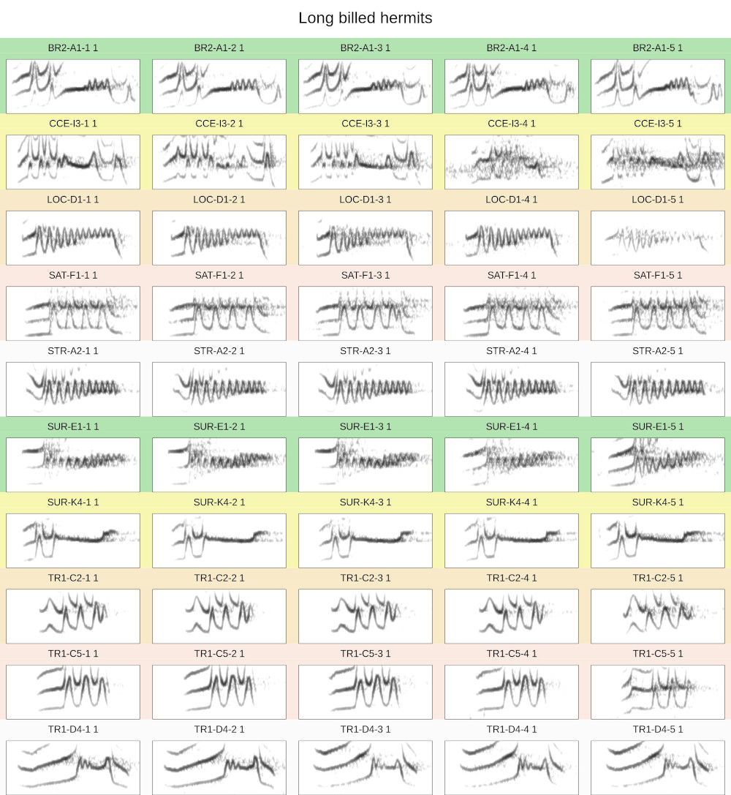
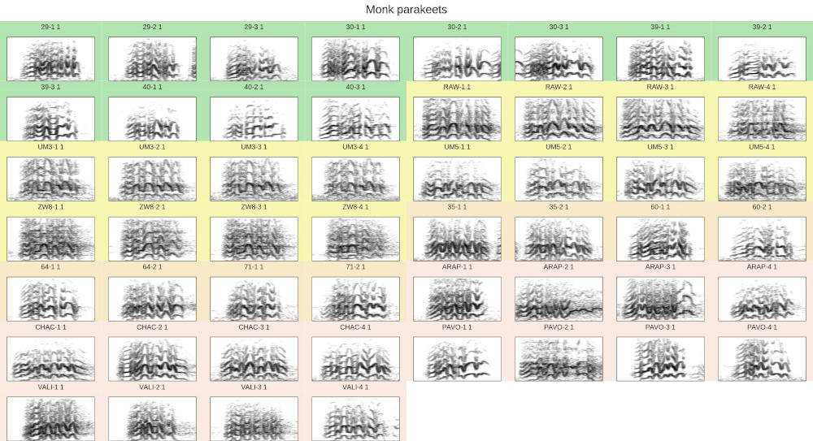
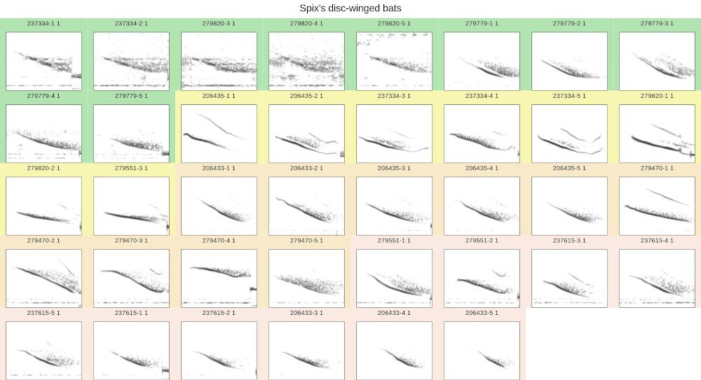
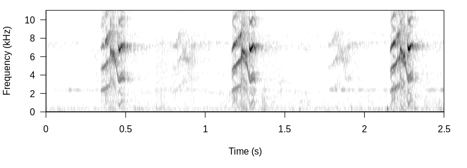
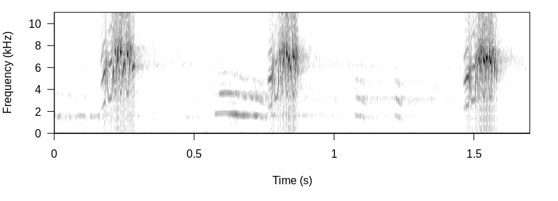
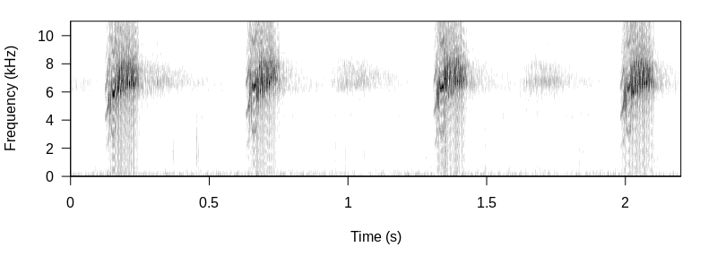
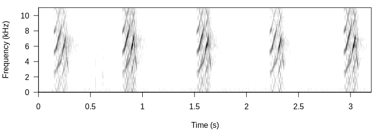
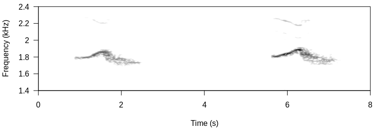

<!-- <script> -->
<!--    $(document).ready(function() { -->
<!--      $head = $('#header'); -->
<!--      $head.prepend('') -->
<!--    }); -->
<!-- </script> -->

<!-- &nbsp;  -->

&nbsp; 

[NatureSounds](https://cran.r-project.org/package=NatureSounds) contains a collection of animal sounds for bioacoustic analysis. The main goal is to provide example acoustic data to faciliate the development of bioacoustic tools in the R environment. At the same time, this data can be used as case studies for showing the functionality of tools already available in R. This tutorial offers a quick glance over the acoustic data sets included in the package.

Most data sets are provided as extended selection tables. These are R objects that contains both the annotations (locations of signals in time and frequency) and the corresponding acoustic data as wave objects. Therefore, these are **self-contained objects** since the original sound files are no longer needed to perform acoustic analyses. These objects are created by the function `selection_table()` from [warbleR](https://cran.r-project.org/package=warbleR). Take a look at the [intro to warbleR vignette](https://cran.r-project.org/package=warbleR/vignettes/Intro_to_warbleR.html) for more details and check out the packages [warbleR](https://cran.r-project.org/package=warbleR),
[tuneR](https://cran.r-project.org/package=tuneR) and [seewave](https://cran.r-project.org/package=seewave) for sound file manipulation and analysis in R.

&nbsp; 

## Long billed hermit songs

 The example data 'lbh.est' is an extended selection table containing long-billed hermit (*Phaethornis longirostris*) songs. The data contains the annotations and wave objects of 50 long-billed hermit songs from 10 different song types (5 per song type, 'lek.song.type' column) recorded at 8 leks ('lek' column) in the Caribbean slope of Costa Rica. This data set was used in [Araya-Salas et al 2019](#references-link) to show lek (social group) level signatures in song structure. See [this blog post](https://marce10.github.io/2019/08/13/group_signature_xcorr.html) for details on statistical analysis.

The spectrograms of the song types can be displayed using the `catalog()` function from [warbleR](https://cran.r-project.org/package=warbleR):


```{r catalog LBH, eval = FALSE}

library(warbleR)

# create a color palette
trc <- function(n) terrain.colors(n = n, alpha = 0.3)

# set global options for catalogs
warbleR_options(same.time.scale = TRUE, mar = 0.001, res = 100, spec.mar = 1, max.group.cols = 5, ovlp = 95,
 width = 23, height = 12.5, tag.pal = list(trc), hatching = 0, cex = 1.3, rm.axes = TRUE, path = "~/Dropbox/R_package_testing/NatureSounds/", box = FALSE)

# load data
data("lbh.est")

# plot catalog
catalog(X = lbh.est, flim = c(1.5, 10.5), nrow = 10, ncol = 5, group.tag = "lek.song.type", height = 25, cex = 2,
        title = "Long billed hermits", img.prefix = "lbh.est", wl = 100)

```



Song types are labeled by color groups of consecutive spectrograms. 

&nbsp; 

## Monk parakeet contact calls

 'monk.parakeet.est' contains annotations and wave objects of 52 monk parakeet calls from four different social scales (individual, flock, pair, site; 'scale' column). The 'ID' column refers to selections belonging to the same individual when `scale == "Individual`. See [Smith-Vidaurre, Araya-Salas & Wright (2019)](#references-link) for more details. 

```{r catalog monk parakeets, eval = FALSE}

# load data
data("monk.parakeet.est")

# monk parakeets
catalog(X = monk.parakeet.est, flim = c(1, 11), nrow = 7, ncol = 8,  group.tag = "scale", 
        title = "Monk parakeets", img.prefix = "monk.parakeet.est", wl = 300)

```



In this case color groups refer to the different social scales in the data.

&nbsp; 

## Spix's disc-winged bat social calls

 'thyroptera.est' is an extended selection table of Spix's disc-winged bats (*Thyroptera tricolor*) social calls. The data contains the annotations and wave objects of social from 8 individual Spix's disc-winged bats ('id' column) belonging to 4 social groups ('group' column). See [Araya-Salas et al (2020)](#references-link) for more details. Can be used (among other things) to test for individual acoustic signatures. 


```{r catalog thyroptera, eval = FALSE}

# load data
data("thyroptera.est")

# thyroptera
catalog(X = thyroptera.est, flim = c(2, 60), nrow = 5, ncol = 8, group.tag = "group", title = "Spix's disc-winged bats", img.prefix = "thyroptera.est", wl = 300)

```



Color groups refer to calls from individuals belonging to the same social group.

&nbsp; 

## Additional acoustic data

The package also includes 5 wave objects that were originally included as example data in [warbleR](https://cran.r-project.org/package=warbleR). These are 4 wave objects with long-billed hermit song bouts and 1 with 2 songs from a little tinamou (*Crypturellus soui*).

### Long billed hermit wave objects

```{r lbh wave objects, eval = FALSE}

# load data
data("Phae.long1", "Phae.long2", "Phae.long3", "Phae.long4", "Cryp.soui")

# spectrogram
seewave::spectro(Phae.long1, wl = 100, scale = FALSE, ovlp = 90, grid = FALSE, palette = seewave::reverse.gray.colors.1, collevels = seq(-50, 0, 5))

```



```{r phae long 2, eval = FALSE}

# spectrogram
seewave::spectro(Phae.long2, wl = 100, scale = FALSE, ovlp = 90, grid = FALSE, palette = seewave::reverse.gray.colors.1, collevels = seq(-50, 0, 5))


```



```{r phae long 3, eval = FALSE}

# spectrogram
seewave::spectro(Phae.long3, wl = 100, scale = FALSE, ovlp = 90, grid = FALSE, palette = seewave::reverse.gray.colors.1, collevels = seq(-50, 0, 5))


```



```{r phae long 4, eval = FALSE}

# spectrogram
seewave::spectro(Phae.long4, wl = 100, scale = FALSE, ovlp = 90, grid = FALSE, palette = seewave::reverse.gray.colors.1, collevels = seq(-50, 0, 5))


```



### Little tinamou wave object

```{r Cryp soui, eval = FALSE}

# spectrogram
seewave::spectro(Cryp.soui, wl = 1200, scale = FALSE, ovlp = 90, grid = FALSE, palette = seewave::reverse.gray.colors.1, collevels = seq(-35, 0, 2), flim = c(1.4, 2.4))


```



&nbsp; 

## References {#references-link}

1. Araya-Salas M, G Smith-Vidaurre. 2017. *warbleR: An R package to streamline analysis of animal acoustic signals*. Methods Ecol Evol 8:184–191.

1. Araya-Salas M, G Smith-vidaurre,  D Mennill, P Gonzalez-Gomez, J Cahill & T Wright. 2019. *Social group signatures in hummingbird displays provide evidence of co-occurrence of vocal and visual learning*. Proceedings of the Royal Society B. 286: 20190666

1. Smith-Vidaurre G, M Araya-Salas, & T Wright. 2019. *Individual signatures outweigh social group identity in contact calls of a communally nesting parrot*.  Behavioral Ecology.

1. Araya-Salas M, A Hernandez-Pinson, N Rojas & G Chaverri. 2020. *Ontogeny of an interactive call-and-response system in Spix's disc-winged bats*. Animal Behaviour.        

&nbsp; 

---

<font size="4">Session information</font>

```{r session info, echo=F}

sessionInfo()

```
